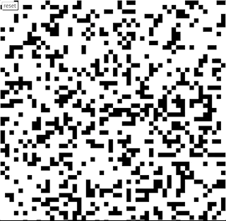
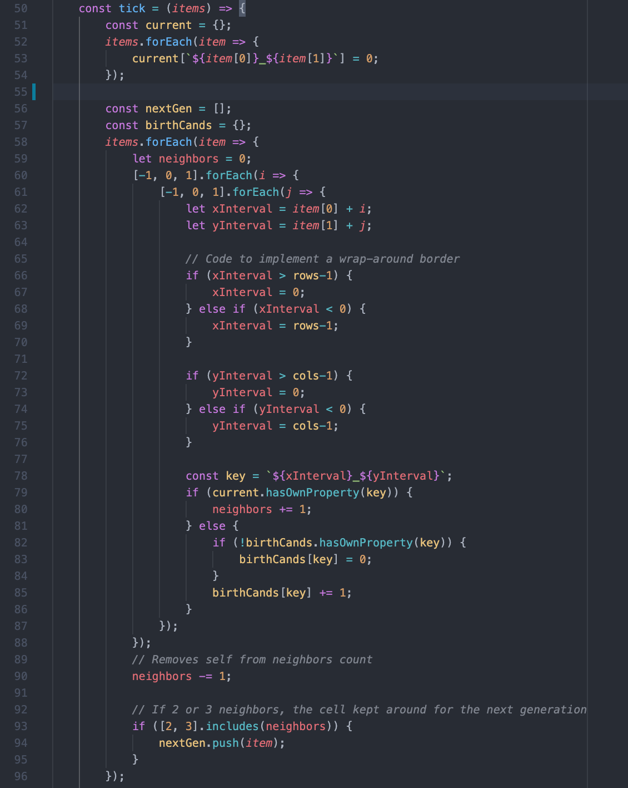
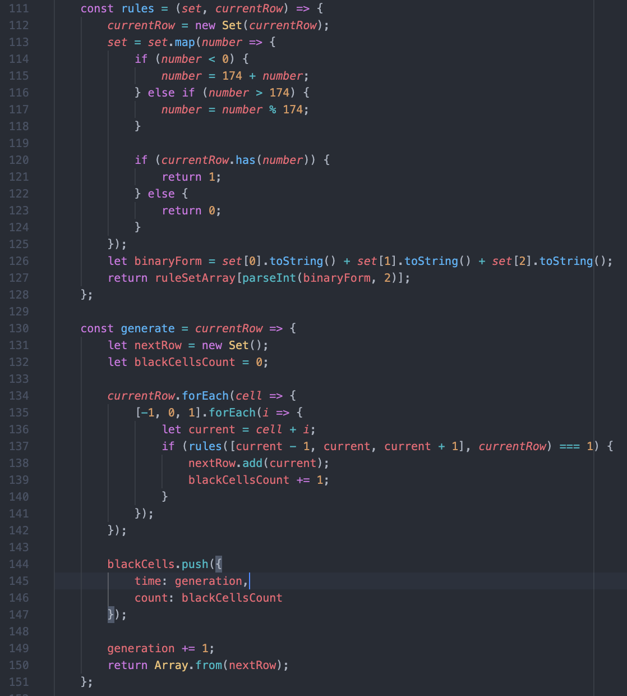
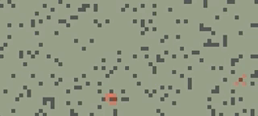
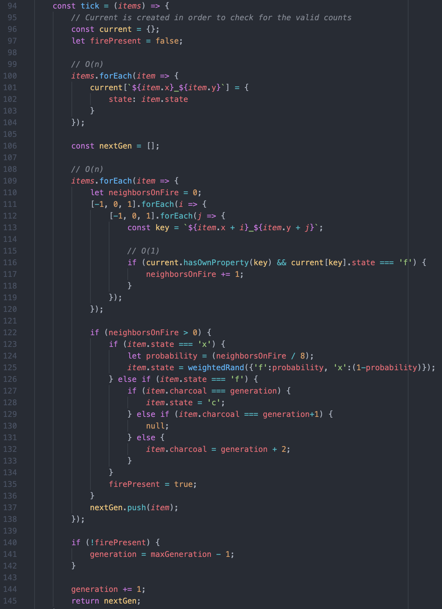
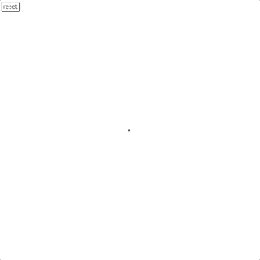
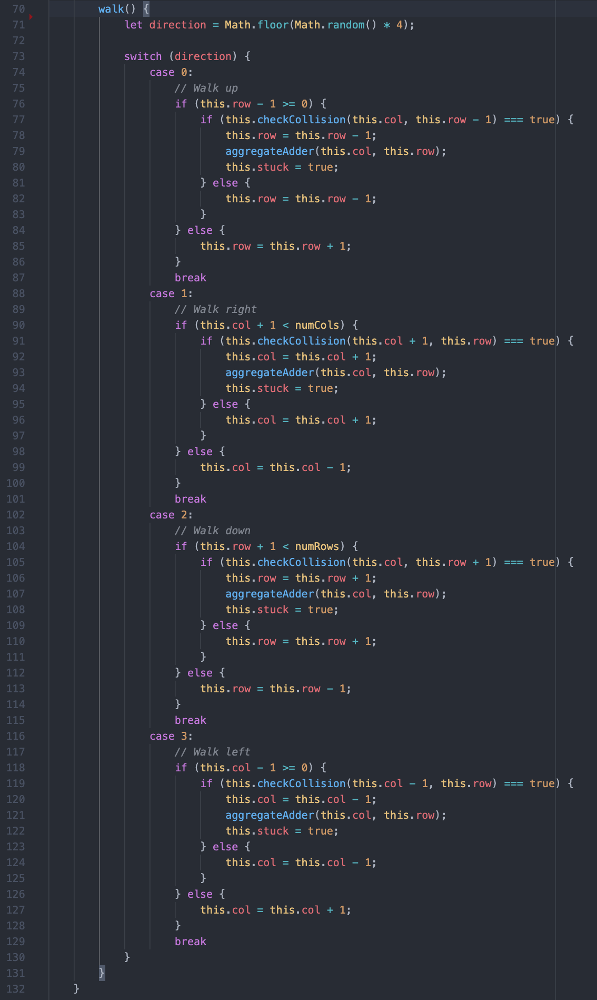

# Cellular Automata
A study on complex systems  
  

## What is it? 
This is a visual journal detailing the process of cellular automata (CA) within the context of complex systems. In addition to understanding CA, applications of CA within real world examples are also simulated. Systems simulated include:
  1. Traffic
  2. Wildfire
  3. Urban Sprawl 
  
 ## Code
 Below, I detail the code involved in each simulation
 
 * ### Basic Cellular Automata 
    
    
    
 * ### Traffic 
    
    
    
 * ### Wildfire
    
    
 
 * ### Urban Sprawl 
    
    
 
